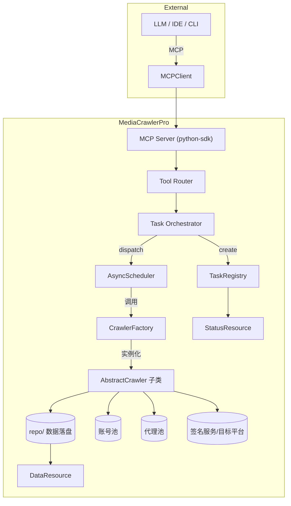
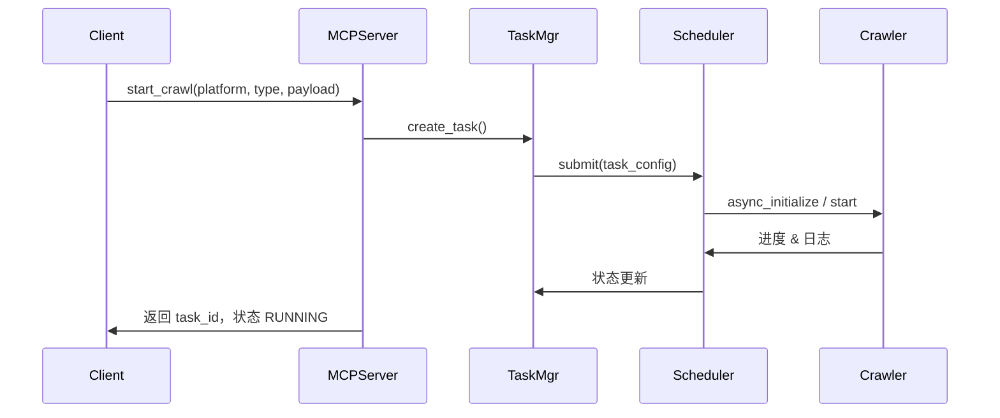

# MCP 多平台控制系统技术设计

## ⚠️ 重要声明

**本项目仅供学习和研究目的使用**，使用者应严格遵守以下原则：

1. **不得用于任何商业用途**
2. 使用时应遵守目标平台的使用条款和 robots.txt 规则
3. 不得进行大规模爬取或对平台造成运营干扰
4. 应合理控制请求频率，避免给目标平台带来不必要的负担
5. 不得用于任何非法或不当的用途

详细许可条款请参阅项目根目录下的 [LICENSE](../LICENSE) 文件。使用本代码即表示您同意遵守上述原则和 LICENSE 中的所有条款。

---

## 1. 背景与目标

MediaCrawlerPro 已经具备小红书、微博、抖音、快手、B 站、贴吧、知乎等主流平台爬虫能力，但目前缺乏统一的“对话式/协议化”总控入口。本设计旨在引入 [modelcontextprotocol/python-sdk](https://github.com/modelcontextprotocol/python-sdk)（下称 MCP SDK），构建一个对接所有现有平台爬虫的 MCP Server，让外部 LLM Agent、CLI 或 IDE 能以 MCP 协议**安全、异步、可观测**地调度所有平台任务。

目标：

- 构建一个 `mcp_server` 模块，暴露「工具（Tool）」与「资源（Resource）」接口，用于控制并观测爬虫任务。
- 打通 `CrawlerFactory` 与 MCP Server，使每个 `AbstractCrawler` 能以统一的任务生命周期（创建、启动、停止、状态查询、结果读写）被协议层调度。
- 全面采用 `asyncio` 协程模型，确保 MCP 请求与爬虫任务可以异步并发且互不阻塞。
- 通过 `uv` 维护依赖（包括 MCP SDK、监控库等），并提供可复现的部署流程。

非目标：

- 不改变各平台爬虫的具体页面解析实现。
- 不新增数据库表结构，仅复用现有 repo/db 组件。如需扩展会在后续迭代独立评审。

## 2. 功能范围

### 2.1 MCP 端能力

- **工具（Tool）对接**  
  - `list_platforms`：列出支持的平台及其能力标签。  
  - `start_crawl`：按照参数启动特定平台、类型（search/detail...）、关键词/话题等任务。  
  - `stop_task`：安全地停止指定任务（协程取消 + 资源释放）。  
  - `get_task_status`：返回进度、速率、剩余量、最近错误。  
  - `stream_task_log`：以 MCP Resource/Tool Streaming 抛出实时日志。
- **资源（Resource）暴露**  
  - `task_summary`：聚合某任务最新的统计数据。  
  - `latest_data/<platform>`：直接读取 repo 层最新写入的数据样例，帮助 Agent 评估抓取结果质量。

### 2.2 业务能力

- 支持所有现有 `media_platform` 下的爬虫类型，以 MCU（MCP Control Unit）身份统一调度。
- 按平台/任务标签划分的并发度控制，确保多任务同时执行时不会压垮目标站点或本地资源。
- 任务级别的断点恢复、日志可追踪、错误原因可快速反馈给 MCP 客户端。

## 3. 系统架构概览



## 4. 组件设计

| 组件 | 位置建议 | 职责 |
|------|----------|------|
| `mcp_server/__init__.py` | 新增模块 | 初始化 MCP Server、注册工具/资源 |
| `mcp_server/tooling.py` | 新增模块 | 定义 Tool 输入输出模型、参数校验 |
| `mcp_server/resources.py` | 新增模块 | 提供资源端点（任务摘要、数据流） |
| `mcp_server/task_manager.py` | 新增模块 | 维护任务生命周期（状态机 + 协程句柄） |
| `mcp_server/log_stream.py` | 新增模块 | 统一日志缓冲、推送给 MCP Stream |
| `mcp_server/schema.py` | 新增模块 | Pydantic 模型，用于 MCP SDK 的结构化返回 |

### 4.1 MCP Server

- 依赖 MCP SDK 暴露 `MCPServer`。  
- 注册工具：`server.tool()` 装饰器 + 异步函数。  
- 注册资源：`server.resource()` 装饰器，支持 `read` 与 `subscribe`。
- 监听端口或 stdio（兼容 `mcp run python -m mcp_server`）。  
- 使用 `asyncio.run(server.run())` 在独立进程启动，也可兼容 `main.py` 里加载（通过命令参数切换）。

### 4.2 Task Manager & Registry

- `TaskManager` 负责：  
  - 生成 `task_id`（`mcp_{platform}_{timestamp}`）。  
  - 维护 `asyncio.Task` 引用、状态、开始时间、统计指标。  
  - 提供 `start_task`, `stop_task`, `get_status`, `cleanup_finished` 等接口。
- 状态模型：`PENDING -> RUNNING -> FINISHED/FAILED/CANCELED`，失败状态记录异常堆栈和最近日志片段。

### 4.3 Async Scheduler

- 核心是 `asyncio.create_task(crawler.start())`，并挂载额外的 watcher。  
- 对应平台的限速由 `asyncio.Semaphore`（例如 `per_platform_limiter[platform]`）控制。  
- 提供心跳协程定期刷新任务统计信息（抓取条数、请求成功率、重试次数）。

### 4.4 Platform Adapter

- TaskManager 不直接依赖具体爬虫，实现一个适配器：  
  - `PlatformAdapter.prepare(config)` -> 构造 `CrawlerFactory` 所需参数（平台名、类型、关键词等）。  
  - `PlatformAdapter.run()` -> 包装 `crawler.async_initialize()` 与 `crawler.start()`，并捕获异常。  
- 适配器负责与 `config`、`cmd_arg` 解耦，可基于函数参数直接注入运行时配置，不污染全局 `config`。

### 4.5 日志与事件

- 通过 `asyncio.Queue` 收集日志事件，`log_stream.py` 将其推送给 MCP Resource（支持实时订阅）。  
- 事件格式：`{timestamp, level, platform, task_id, message}`，方便外部 Agent 解析。

## 5. 关键流程

### 5.1 `start_crawl` 操作



### 5.2 `get_task_status`

- MCP Server 从 TaskManager 读取缓存信息。  
- 若任务结束，提供结果摘要（最后 N 条数据 ID、存储位置等）。  
- 若任务挂起/失败，附带错误堆栈、建议操作。

## 6. 异步编排策略

- MCP Server 与 TaskManager 同处一个 `asyncio` 事件循环，避免多线程锁。  
- 所有外部 I/O（HTTP、DB、Redis）沿用项目现有的异步实现；若存在同步阻塞调用需要封装在 `asyncio.to_thread`。  
- `uvloop` 可选：在 `main_mcp.py` 中检测可用后 `asyncio.set_event_loop_policy(uvloop.EventLoopPolicy())`，提升并发吞吐。  
- 提供健康检查协程，若任务长时间无进度则触发 MCP 端事件通知。

## 7. 配置与数据模型

- 新增 `config_mcp.py` 或在 `config.py` 中追加以下配置：  
  - `MCP_SERVER_ENABLED`：是否启动 MCP Server。  
  - `MCP_SERVER_MODE`：`stdio` / `tcp` / `websocket`。  
  - `MCP_TASK_DEFAULT_TIMEOUT`、`MCP_LOG_BUFFER_SIZE` 等参数。  
- Pydantic 模型示例：

```python
class StartCrawlInput(BaseModel):
    platform: str
    crawl_type: Literal["search", "detail", "comment"]
    keyword: str | None = None
    task_options: dict[str, Any] = Field(default_factory=dict)
```

- Task 状态模型 `TaskStatus` 包含 `task_id`, `platform`, `state`, `progress`, `metrics`, `last_error`.

## 8. 依赖与开发流程（uv）

- 使用 `uv` 维护依赖锁：  
  1. `uv pip install modelcontextprotocol`（或 `uv add modelcontextprotocol`）。  
  2. 同时安装观测/验证所需库（如 `rich`, `fastapi-sse` 之类，如果未来扩展）。  
  3. 更新 `pyproject.toml` & `uv.lock`。  
- 本地调试：  
  - `uv run python -m mcp_server` 启动 MCP Server。  
  - `mcp dev`（官方 CLI）或 `Claude Desktop` 等客户端指向本地 Server，测试工具/资源。  
- CI：在 `uv` 环境中运行 `pytest` + `mypy`，并模拟 MCP 调用（可用 `pytest-asyncio`）。

## 9. 日志、观测与告警

- 统一用 `pkg.tools.utils.init_logging_config` 输出结构化日志，再由 `log_stream.py` 转发给 MCP 客户端。  
- 统计指标：  
  - `requests_per_minute`, `success_rate`, `retry_count`, `data_items_collected`.  
  - 每个任务在结束时写入 `logs/mcp_tasks/{task_id}.json`，供排障。  
- 若任务异常退出：  
  - 立即推送 `FAILED` 状态 + 错误摘要到 MCP。  
  - 标记 `needs_attention=True`，由客户端决定是否自动重试。

## 10. 安全与合规

- MCP Server 对外只提供受控工具，所有危险操作必须经过白名单校验。  
- 对 `start_crawl` 参数做严格校验（平台枚举、关键词长度、速率限制）。  
- 结合账号池/代理策略，默认在 MCP 层面 enforce 最大并发，避免滥用。  
- 保持 License 申明，MCP 回复需附带“仅限学习用途”提示。

## 11. 测试策略

- **单元测试**：  
  - TaskManager 状态机转换。  
  - PlatformAdapter 的参数映射正确性。  
  - 日志流模块的订阅/退订。
- **集成测试**（使用 `pytest-asyncio` + 假平台爬虫）：  
  - 启动 MCP Server，在测试中通过 SDK 客户端调用工具，验证任务全生命周期。  
  - 模拟异常（网络错误、账号失败）确保状态与日志输出正确。  
- **回归测试**：保证引入 MCP 后对 `python main.py --platform xxx` 的传统模式无影响。

## 12. 迭代路线与里程碑

1. **第一阶段**：搭建基础 MCP Server、TaskManager、一个示例平台（如小红书搜索）调通。  
2. **第二阶段**：对接所有平台 crawler，补齐日志、资源视图，并完善测试。  
3. **第三阶段**：增强可观测性（任务结果摘要、数据抽样资源）、支持自动重试和任务编排。  
4. **第四阶段**：考虑与外部系统（如调度中心、LLM Agent Hub）联动，提供权限控制与审计。

---

通过以上设计，MediaCrawlerPro 将获得一个统一的 MCP 控制平面，既保留现有的多平台爬虫能力，又能让外部 Agent 在一个标准协议下安全地调用所有平台爬虫，实现“对话式”调度与观测。
