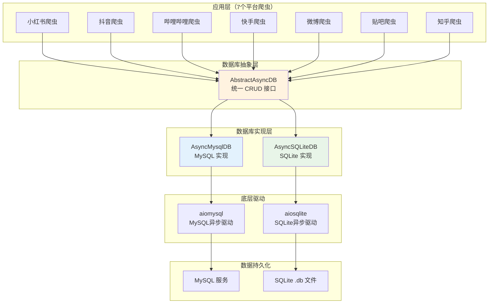
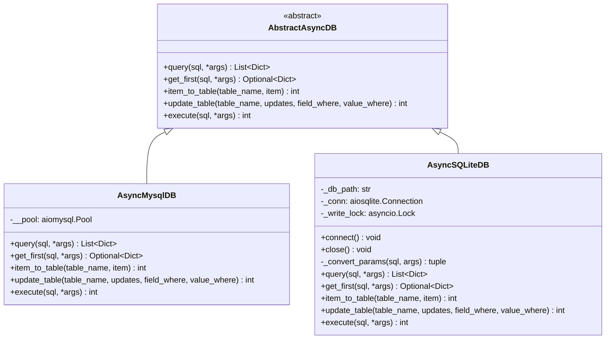
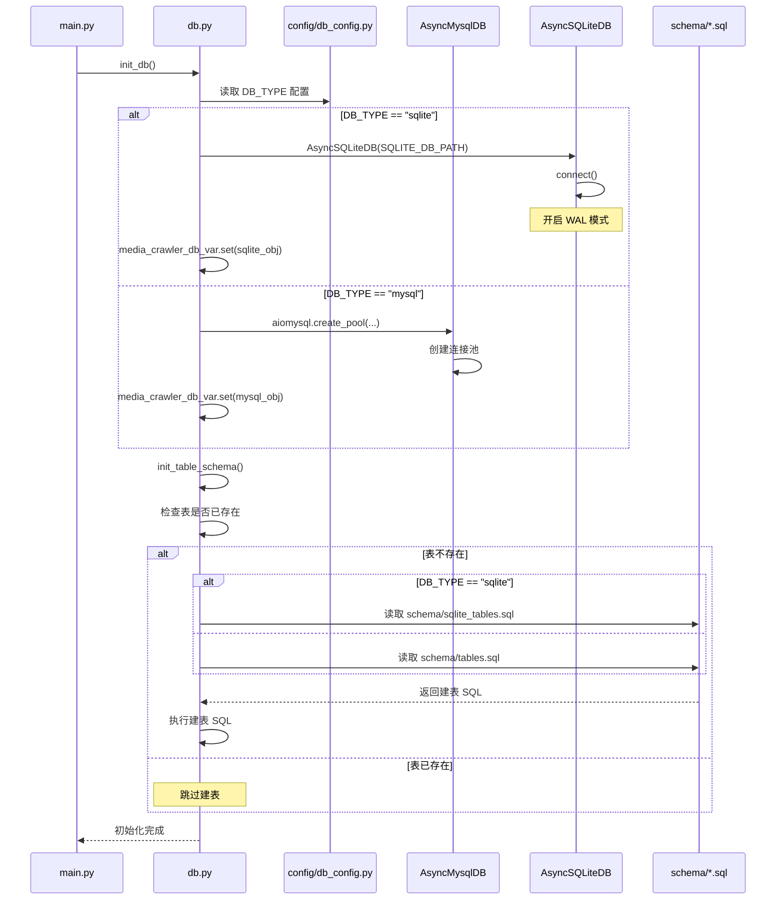
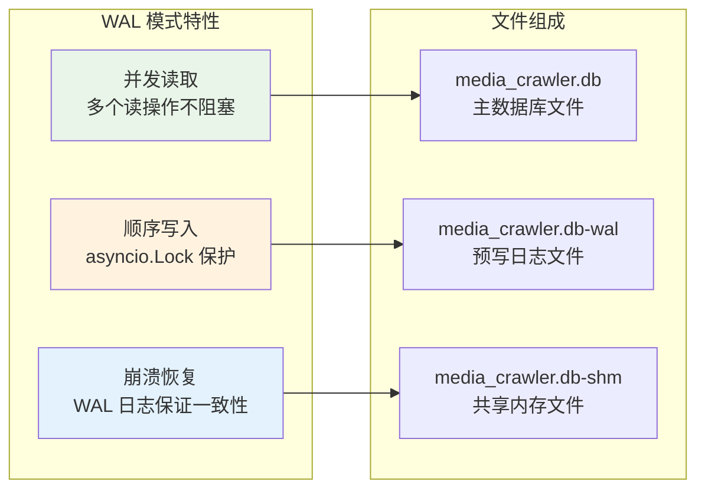
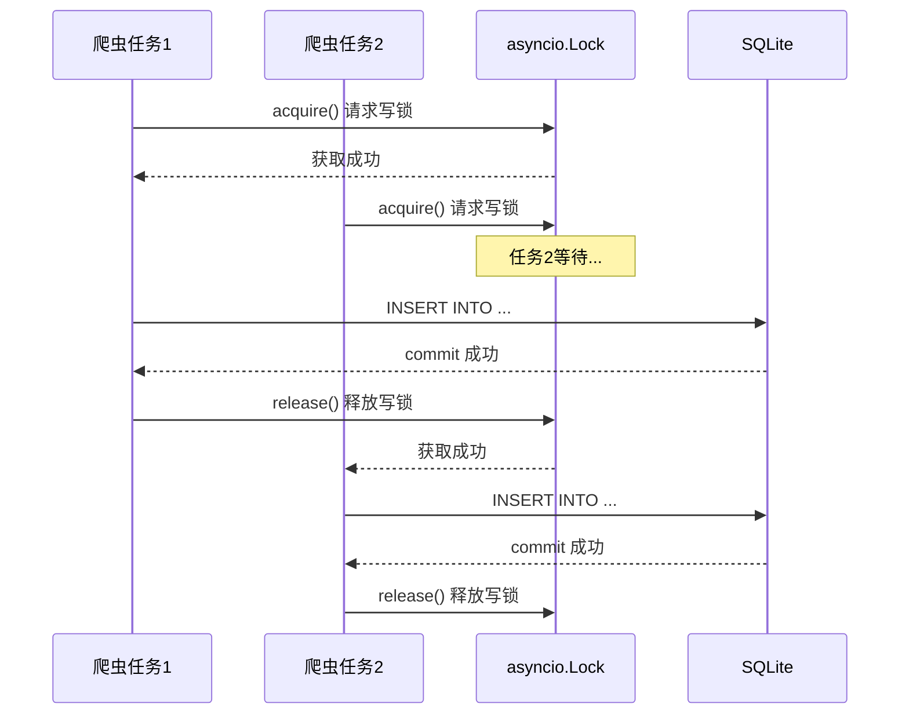
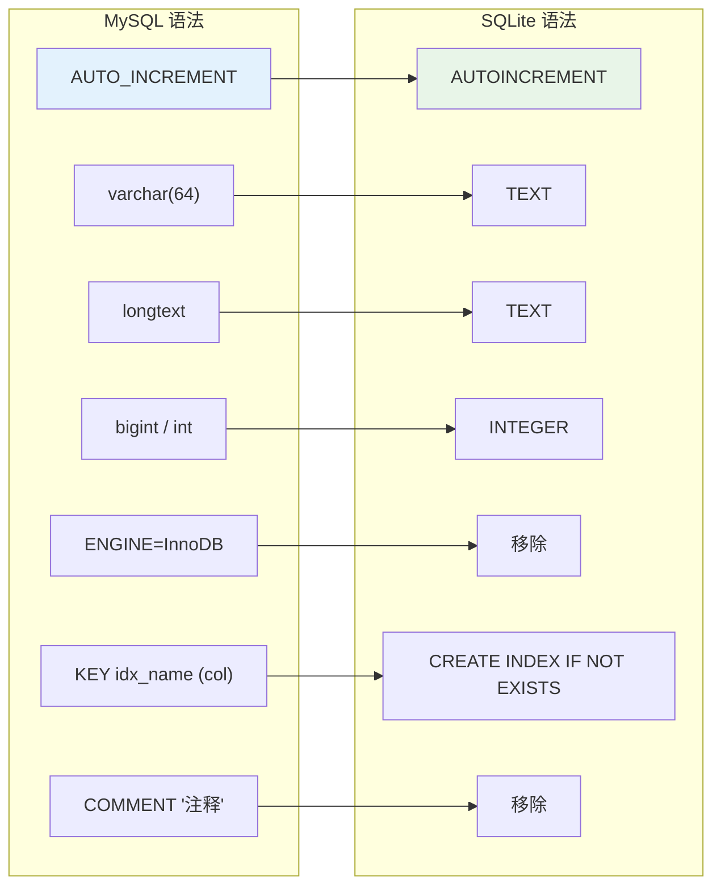
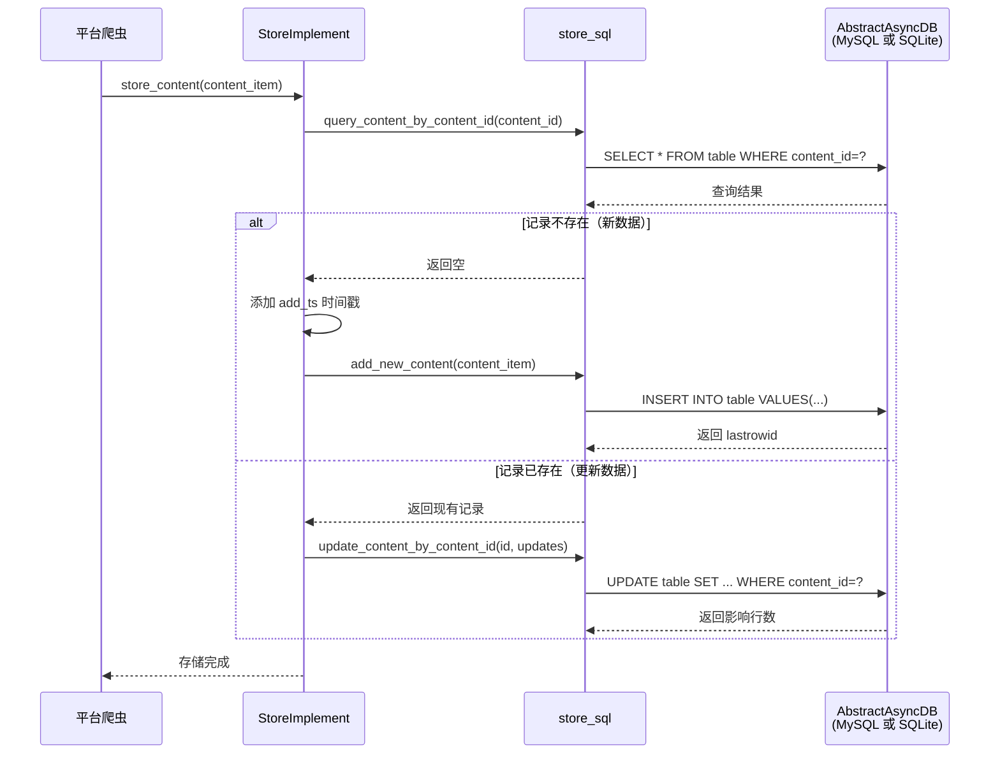
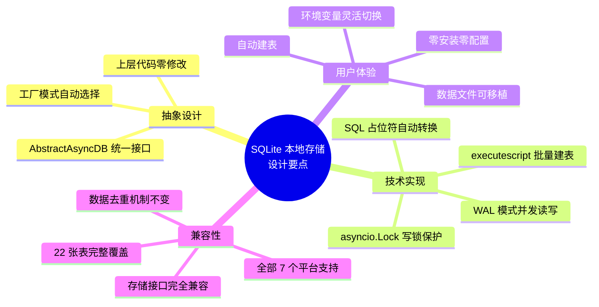

# 7. SQLite 本地存储技术文档

## 重要声明

**本项目仅供学习和研究目的使用**，使用者应严格遵守以下原则：

1. **不得用于任何商业用途**
2. 使用时应遵守目标平台的使用条款和robots.txt规则
3. 不得进行大规模爬取或对平台造成运营干扰
4. 应合理控制请求频率，避免给目标平台带来不必要的负担
5. 不得用于任何非法或不当的用途

详细许可条款请参阅项目根目录下的 [LICENSE](../LICENSE) 文件。

---

## 1. 概述

从 `v2025.03` 版本开始，MediaCrawlerPro 新增了 **SQLite 本地存储**支持。用户无需安装 MySQL 等外部数据库服务，即可使用数据库存储方式，享受数据去重、高效查询等能力。

本次重构引入了 **数据库抽象层**（`AbstractAsyncDB`），使用抽象工厂模式实现 MySQL 和 SQLite 的无缝切换，所有 7 个平台的爬虫代码无需任何修改即可同时支持两种数据库。

### 1.1 为什么需要 SQLite 支持？

| 痛点 | SQLite 方案 |
|------|------------|
| MySQL 安装配置复杂 | SQLite 零安装，Python 原生支持 |
| 本地开发/学习门槛高 | 一个 `.db` 文件即可运行 |
| 云服务器资源有限 | SQLite 内存占用极小 |
| 只想快速试用 | 改一个配置即可启动 |

### 1.2 SQLite vs MySQL 对比

| 特性 | SQLite | MySQL |
|------|--------|-------|
| 安装依赖 | 无需安装，Python自带 | 需要安装MySQL服务 |
| 适用场景 | 本地开发、学习、小规模爬取 | 生产环境、大规模爬取 |
| 并发性能 | 单写多读（WAL模式） | 高并发读写 |
| 数据去重 | 支持 | 支持 |
| 数据文件 | 单个 `.db` 文件 | 服务端存储 |
| 迁移便利性 | 复制文件即可 | 需要导出导入 |

## 2. 快速开始

### 2.1 配置方式

**方式一：修改配置文件**

编辑 `config/db_config.py`：

```python
# database type: "mysql" or "sqlite"
DB_TYPE = "sqlite"

# SQLite 数据库文件路径（DB_TYPE=sqlite 时生效）
SQLITE_DB_PATH = "./media_crawler.db"
```

**方式二：通过环境变量设置**

```bash
export DB_TYPE=sqlite
export SQLITE_DB_PATH=./media_crawler.db
```

### 2.2 启动爬虫

配置完成后，和之前的使用方式完全一致：

```bash
# 确保 SAVE_DATA_OPTION 为 db（默认值）
uv run main.py --platform xhs --type search

# 或者使用环境变量一行搞定
DB_TYPE=sqlite uv run main.py --platform xhs --type search
```

首次运行会自动创建 SQLite 数据库文件和所有表结构，无需手动建表。

### 2.3 查看数据

SQLite 数据存储在本地 `.db` 文件中（默认路径 `./media_crawler.db`），推荐使用以下工具查看：

- [DB Browser for SQLite](https://sqlitebrowser.org/) - 免费开源的图形化工具
- [DBeaver](https://dbeaver.io/) - 通用数据库管理工具
- 命令行：`sqlite3 media_crawler.db`

## 3. 数据库抽象层架构

### 3.1 整体架构



### 3.2 抽象基类设计



### 3.3 初始化流程



## 4. SQLite 实现关键技术

### 4.1 WAL 模式（Write-Ahead Logging）

SQLite 默认的日志模式是 rollback journal，在写入时会锁定整个数据库。WAL 模式允许**读写并发**，非常适合爬虫这种写多读少的场景。

```python
# async_db.py - AsyncSQLiteDB.connect()
async def connect(self) -> None:
    self._conn = await aiosqlite.connect(self._db_path)
    await self._conn.execute("PRAGMA journal_mode=WAL")
    await self._conn.commit()
```



### 4.2 异步写锁机制

SQLite 不支持真正的并发写入，因此使用 `asyncio.Lock` 来序列化所有写操作，避免数据库锁冲突：

```python
# async_db.py - AsyncSQLiteDB
def __init__(self, db_path: str) -> None:
    self._write_lock = asyncio.Lock()

async def item_to_table(self, table_name, item):
    async with self._write_lock:  # 获取写锁
        async with self._conn.execute(sql, values) as cursor:
            await self._conn.commit()
            return cursor.lastrowid
```



### 4.3 SQL 占位符自动转换

MySQL 使用 `%s` 作为参数占位符，SQLite 使用 `?`。抽象层在 SQLite 实现中自动完成转换，上层代码无需关心差异：

```python
@staticmethod
def _convert_params(sql: str, args: tuple) -> tuple:
    """将 MySQL 的 %s 占位符转换为 SQLite 的 ? 占位符"""
    return sql.replace('%s', '?'), args
```

这意味着所有平台的 SQL 操作代码（如 `xhs_store_sql.py`、`bilibili_store_sql.py` 等）可以使用统一的 `%s` 写法，由数据库层自动处理兼容性。

## 5. 表结构自动初始化

### 5.1 双 Schema 文件

项目维护了两套建表脚本：

| 文件 | 用途 | 语法特点 |
|------|------|---------|
| `schema/tables.sql` | MySQL 建表 | `AUTO_INCREMENT`、`varchar(n)`、`ENGINE=InnoDB` |
| `schema/sqlite_tables.sql` | SQLite 建表 | `AUTOINCREMENT`、`TEXT`、`CREATE INDEX` |

### 5.2 Schema 转换规则



### 5.3 支持的数据表（共 22 张）

覆盖全部 7 个平台：

| 平台 | 内容表 | 评论表 | 创作者表 |
|------|--------|--------|---------|
| 哔哩哔哩 | `bilibili_video` | `bilibili_video_comment` | `bilibili_up_info` |
| 抖音 | `douyin_aweme` | `douyin_aweme_comment` | `douyin_creator` |
| 快手 | `kuaishou_video` | `kuaishou_video_comment` | `kuaishou_creator` |
| 小红书 | `xhs_note` | `xhs_note_comment` | `xhs_creator` |
| 微博 | `weibo_note` | `weibo_note_comment` | `weibo_creator` |
| 贴吧 | `tieba_note` | `tieba_note_comment` | `tieba_creator` |
| 知乎 | `zhihu_content` | `zhihu_content_comment` | `zhihu_creator` |

另有通用表：`crawler_cookies_account`（账号 Cookies 管理）

## 6. 数据存储流程

### 6.1 统一存储接口

所有平台爬虫通过 `ContextVar` 获取数据库实例，调用方式完全一致：

```python
# 任意平台的 store_sql.py 中
from var import media_crawler_db_var
from async_db import AbstractAsyncDB

async_db_conn: AbstractAsyncDB = media_crawler_db_var.get()

# 查询
rows = await async_db_conn.query(sql, param1, param2)

# 插入
last_id = await async_db_conn.item_to_table("xhs_note", item_dict)

# 更新
affected = await async_db_conn.update_table("xhs_note", updates, "note_id", note_id)
```

### 6.2 数据去重流程



## 7. 配置参数说明

### 7.1 完整配置项

在 `config/db_config.py` 中：

```python
# ============ 数据库类型选择 ============
# "mysql" - 使用 MySQL 数据库（需要安装 MySQL 服务）
# "sqlite" - 使用 SQLite 本地数据库（无需额外安装）
DB_TYPE = os.getenv("DB_TYPE", "mysql")

# ============ SQLite 配置 ============
# SQLite 数据库文件路径（仅 DB_TYPE=sqlite 时生效）
# 支持相对路径和绝对路径
SQLITE_DB_PATH = os.getenv("SQLITE_DB_PATH", "./media_crawler.db")

# ============ MySQL 配置（DB_TYPE=mysql 时生效） ============
RELATION_DB_PWD = os.getenv("RELATION_DB_PWD", "123456")
RELATION_DB_USER = os.getenv("RELATION_DB_USER", "root")
RELATION_DB_HOST = os.getenv("RELATION_DB_HOST", "localhost")
RELATION_DB_PORT = int(os.getenv("RELATION_DB_PORT", 3306))
RELATION_DB_NAME = os.getenv("RELATION_DB_NAME", "media_crawler_pro")
```

### 7.2 环境变量汇总

| 环境变量 | 默认值 | 说明 |
|---------|--------|------|
| `DB_TYPE` | `mysql` | 数据库类型，可选 `mysql` 或 `sqlite` |
| `SQLITE_DB_PATH` | `./media_crawler.db` | SQLite 数据库文件路径 |

## 8. 注意事项与最佳实践

### 8.1 使用建议

1. **学习和本地开发**：推荐使用 SQLite，零配置即可运行
2. **生产环境和大规模爬取**：推荐使用 MySQL，并发性能更好
3. **数据迁移**：SQLite 数据可以方便地导出为 SQL 再导入 MySQL

### 8.2 注意事项

1. **并发写入**：SQLite 使用写锁序列化写操作，`MAX_CONCURRENCY_NUM` 建议保持较低值（1-3）
2. **文件路径**：`SQLITE_DB_PATH` 支持相对路径和绝对路径，确保目录存在且有写权限
3. **WAL 文件**：运行时会产生 `.db-wal` 和 `.db-shm` 附属文件，这是正常现象，已在 `.gitignore` 中忽略
4. **账号池存储**：SQLite 模式仍然支持 MySQL 账号池存储（`ACCOUNT_POOL_SAVE_TYPE`），两者独立配置
5. **首次运行**：会自动创建数据库文件和全部 22 张表，无需手动操作

### 8.3 从 MySQL 切换到 SQLite

只需两步：

```bash
# 1. 设置环境变量
export DB_TYPE=sqlite

# 2. 正常启动爬虫（自动建表）
uv run main.py --platform xhs --type search
```

### 8.4 架构设计优势



---

**再次提醒：本项目仅供学习和研究目的使用，请严格遵守相关法律法规和平台使用条款，不得用于任何商业用途或违法行为。**
